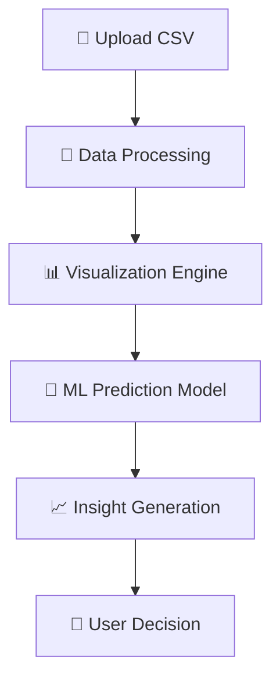

#  DataNova
! Most people don’t struggle with data… they struggle with understanding it.

# 🧠 The Problem

Today, data is everywhere.

But the truth is:

> ❌ 90% of people cannot extract value from their data  
> ❌ CSV files are powerful… but useless without analysis  
> ❌ Most tools are too complex for beginners  
> ❌ Dashboards take hours or days to build  

###  Result:
People have data… but no insights.

---

#  The Solution — DataNova

**DataNova is not just a project.**

It is a **data intelligence engine** that transforms raw CSV files into:

- 📊 Meaningful insights  
- 📈 Visual stories  
- 🤖 Predictive intelligence  
- 🧠 Decision support  

> Upload → Understand → Predict → Decide

---

#  Why DataNova is different?

Unlike traditional dashboards or ML tools:

### 🚫 Others:
- Require coding knowledge
- Require setup & configuration
- Focus on engineers only
- Static and slow insights

---

###  DataNova:
- Zero setup
- Instant insights
- Built for everyone (students, analysts, creators)
- Human-friendly intelligence
- One-click prediction system

---

#  Real Impact

> Data is useless until it becomes a decision.

DataNova helps you:

-  Understand patterns in seconds
-  Detect trends you didn’t notice
-  Predict outcomes without ML knowledge
-  Turn confusion into clarity

---


#  Tech Stack

| Layer           | Technology            |
|---------------- |-----------            |
| Frontend        | React + TypeScript    |
| Styling         |       Tailwind CSS    |
| Charts          |       Plotly.js       |
| Build Tool      |       Vite            |
| Testing         |       Vitest          |
| Package Manager |       Bun / npm       |
| Code Quality    |       ESLint          |

---

# 🧠 Core Features

| Feature             |         Description                   |
|---------------------|---------------------------------------|
|  CSV Upload         | Import any dataset instantly          |
|  Auto Analysis      | Detects patterns, stats, correlations |
|  Data Visualization | Interactive charts powered by Plotly  |
| Prediction Engine   | ML model for forecasting results      |
|  Real-time UI       | Fast and responsive interface         |

---

# ⚙️ System Workflow


---
 ```
src/
│
├── components/     # UI components
├── pages/          # App pages
├── hooks/          # Custom React hooks
├── lib/            # Utilities
├── test/           # Unit tests
│
├── App.tsx
├── main.tsx
└── index.css
```
---
```
# Deployment 

### install dependencies
npm install

### run development server
npm run dev

### build production version
npm run build

### preview build
npm run preview
```
##  Vision Statement

> DataNova aims to evolve from a data tool  
> into a **self-aware intelligence ecosystem for decision-making**.

---

##  Final Thought

```diff
- Today: humans interpret data
+ Future: data interprets itself
